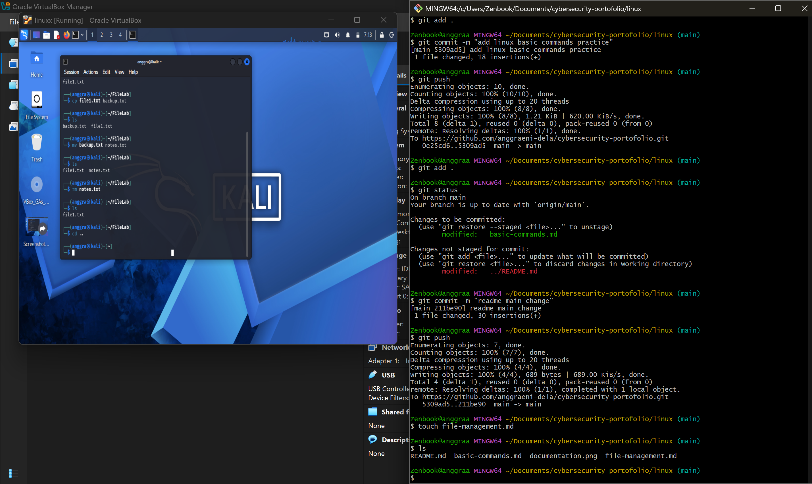

# Linux File Management

## Objective

Learn how to manage files and directories using common Linux commands.

---

## Commands

### cp

Copies a file.

```bash
cp file1.txt backup.txt
```

### mv

Moves or renames a file.

```bash
mv backup.txt notes.txt
```

### rm

Removes a file.

```bash
rm notes.txt
```

### rmdir

Removes an empty directory.

```bash
rmdir Practice
```

---

## Practice

Commands executed:

```bash
touch file1.txt
cp file1.txt backup.txt
mv backup.txt notes.txt
rm notes.txt
ls
```

## Result

Successfully copied, renamed, deleted, and verified files using Linux commands.

## Conclusion

Linux file management commands are essential for organizing files efficiently and are frequently used in system administration and cybersecurity.

## Screenshot

