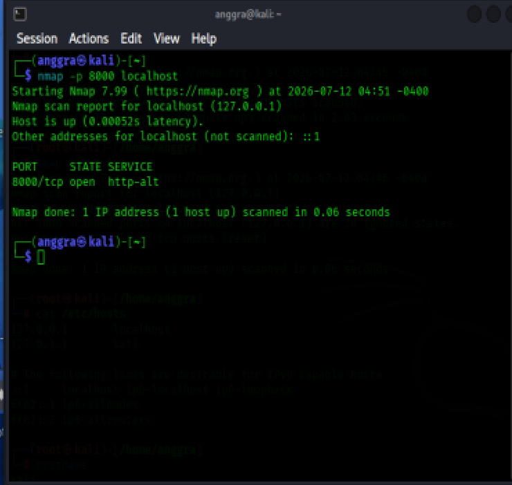

# Nmap Basic Scan

## Objective

Learn how to perform basic network scanning using Nmap on the local machine.

---

## Theory

Nmap (Network Mapper) is an open-source tool used to discover hosts, identify open ports, detect running services, and perform network reconnaissance.

---

## Commands

```bash
nmap localhost
nmap -p 8000 localhost
```

---

## Practice

### Basic Scan

The first scan was performed on the localhost to identify open TCP ports.

### Scan Specific Port

A simple Python HTTP server was started on port 8000, then Nmap was used to verify that the port was open.

---

## Result

- Successfully scanned the localhost.
- Verified that port 8000 was open while the HTTP server was running.

---

## Screenshots

### Basic Scan


### Open Port Scan



---

## Conclusion

Nmap can be used to identify open ports and discover running network services. This information is valuable for system administration, troubleshooting, and authorized security assessments.