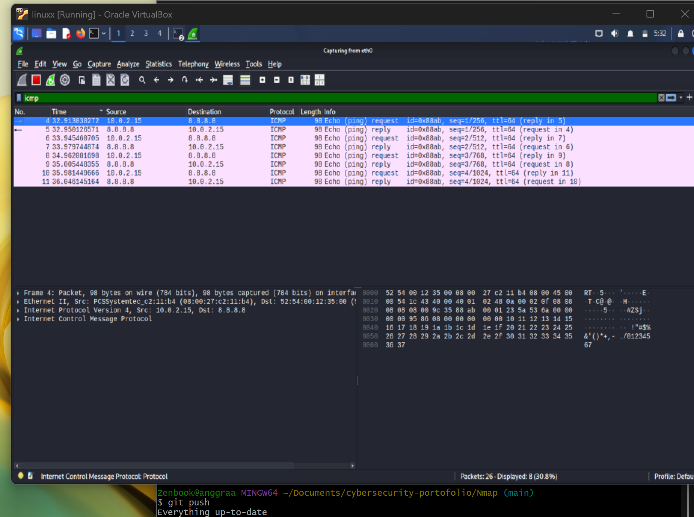

# Wireshark Packet Capture

## Objective

Learn how to capture and analyze ICMP packets using Wireshark.

---

## Theory

Wireshark is a network protocol analyzer used to capture and inspect network traffic in real time.

ICMP (Internet Control Message Protocol) is commonly used for network diagnostics, such as the `ping` command.

---

## Commands

```bash
ping 8.8.8.8 -c 4
```

---

## Practice

1. Open Wireshark.
2. Select the active network interface (eth0).
3. Start packet capture.
4. Run the ping command in the terminal.
5. Apply the display filter:

```text
icmp
```

6. Observe the ICMP Echo Request and Echo Reply packets.

---

## Result

The packet capture successfully displayed ICMP Echo Request packets sent from the local machine to Google's DNS server (8.8.8.8), followed by ICMP Echo Reply packets received from the destination.

---

## Screenshot

